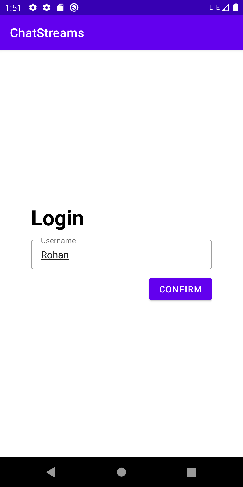
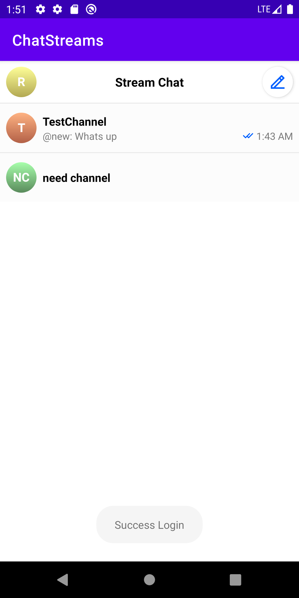
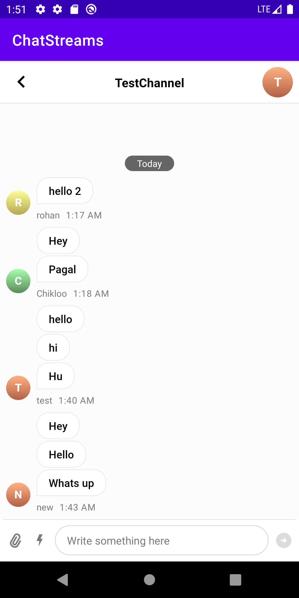

# ChatStreams

ChatStream app is realtime messaging app using [GetStream](https://getstream.io/chat/docs/sdk/android/) Chat Sdk to show case the realtime messaging
features.

## About

* Signs up guest user.
* Shows list of channel in the screen.
* On Tap on channel show the chat screen where you can chat easily.

<table style="width:100%">
  <tr>
    <th>Login Screen</th>
    <th>ChannelList Screen</th>
    <th>Chat Screen</th>
  </tr>
  <tr>
    <td></td>
    <td></td> 
    <td></td>
  </tr>
</table>

## Built With 🛠

- [Kotlin](https://kotlinlang.org/) - First class and official programming language for Android
  development.
- [Coroutines](https://kotlinlang.org/docs/reference/coroutines-overview.html) - For asynchronous
  and more..
- [GetStream](https://getstream.io/chat/docs/sdk/android/) - Stream Chat Android SDK enables you to easily build any type of chat or messaging experience for Android, either in Kotlin or Java
- [Android Architecture Components](https://developer.android.com/topic/libraries/architecture) -
  Collection of libraries that help you design robust, testable, and maintainable apps.
    - [Stateflow](https://developer.android.com/kotlin/flow/stateflow-and-sharedflow) - StateFlow is a state-holder observable flow that emits the current and new state updates to its collectors.
    - [ViewModel](https://developer.android.com/topic/libraries/architecture/viewmodel) - Stores UI-related data that isn't destroyed on UI changes.
    - [Jetpack Navigation](https://developer.android.com/guide/navigation) - Navigation refers to the interactions that allow users to navigate across, into, and back out from the different pieces of content within your app
- [Material Components for Android](https://github.com/material-components/material-components-android)
  - Modular and customizable Material Design UI components for Android